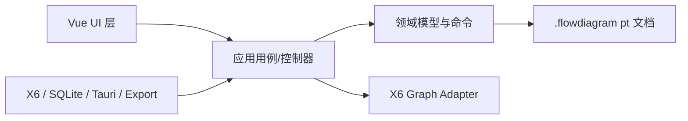

# 桌面流程图编辑器 概要设计

**版本：** 4.1  
**状态：** 最终设计基线（已对齐原型 HTML v2）

## 1. 设计基线与架构原则

本文件定义当前流程图编辑器的最终架构与实现边界。Tauri 2 提供 Windows/macOS 原生能力；Vue 3 + AntV X6 提供编辑画布；领域模型、用户行为命令、pt 坐标和 `.flowdiagram` 文件是系统稳定契约。

### 核心架构原则

1. **平台能力**：应用以 Tauri 2 运行在 Windows 与 macOS，本地文件、SQLite、导出和系统能力通过 Rust 平台层提供；核心编辑流程离线可用。
2. **撤销机制**：用户撤销与重做以领域命令表示完整用户行为。X6 只承担画布渲染和交互事件，不作为用户历史的来源。
3. **坐标系统**：文档、图元、页面、命令快照和 SVG/PDF 导出统一使用 pt 逻辑坐标；CSS px 仅用于 WebView 的视口渲染。
4. **文件格式**：`.flowdiagram` 是唯一用户图文件，包含稳定的领域模型与版本信息；X6 JSON 只在运行时由适配器生成和消费。
5. **页面管理**：PageManager 维护各页面的领域数据、视口状态和命令栈。页面切换释放当前 Graph 并重建目标页面的 Graph/适配器，避免保留运行时插件实例。

## 2. 总体架构



**目录物理分离**：`domain/`、`application/`、`infrastructure/`、`ui/`。功能逻辑禁止放入 Vue 文件；Vue 禁止包含命令、SQL、单位公式或平台调用。

## 3. 模块划分

### 3.1 核心模块

| 模块 | 责任 | X6/技术基础 |
|---|---|---|
| CanvasAdapter | Graph 生命周期、文档↔Cell 映射 | Graph、Scroller、Selection |
| Interaction | 拖拽、框选、快捷键、吸附、端口 | Dnd、Keyboard、Snapline、Transform |
| CommandHistory | 用户行为级撤销/重做 | 自定义 Command，不用 X6 History |
| PageManager | 多页、背景页、切换、页面设置 | 单活跃 Graph，页面领域状态 |
| ShapeRegistry | 内置/业务形状、端口、缩略图、样式 | registerNode、ports |
| TextService | 文本会话、样式、块/段落 | HTML 覆盖编辑器 |
| LayoutService | 水平/垂直方向对齐、两两形状等距排列、自动连线、层级、组合 | 领域几何算法 |
| Persistence | 文件、恢复、最近文件、SQLite | Tauri/Rust、原子写入 |
| Export | SVG/PNG/PDF、打印分页 | X6 export + Rust/PDF |

### 3.2 UI 模块

| 模块 | 责任 | 位置 |
|---|---|---|
| TitleBar | 应用图标、文件名、窗口控制 | `ui/shell/TitleBar.vue` |
| MenuBar | 7 个菜单项（文件/编辑/视图/插入/格式/工具/帮助） | `ui/shell/MenuBar.vue` |
| CompactToolbar | 紧凑工具栏48px（操作/粘贴板/字体/段落对齐） | `ui/toolbar/CompactToolbar.vue` |
| PageTabs | 页面标签、新建页 | `ui/pages/PageTabs.vue` |
| ElementLibrary | 图元库（搜索、分类、3列网格） | `ui/shapes/ElementLibrary.vue` |
| RightPanel | 右侧面板（属性/页面设置 2标签 + 查找替换模式） | `ui/inspector/RightPanel.vue` |
| PropertyTab | 属性标签页（节点信息/几何/样式/文本） | `ui/inspector/PropertyTab.vue` |
| PageSetupTab | 页面设置标签页（页面属性/连线配置） | `ui/pages/PageSetupTab.vue` |
| FindReplaceTab | 查找替换模式（从菜单触发） | `ui/search/FindReplaceTab.vue` |
| ExportDialog | 导出对话框（模态） | `ui/dialogs/ExportDialog.vue` |
| StatusBar | 选中信息、坐标、页码、缩放下拉、状态按钮 | `ui/shell/StatusBar.vue` |
| CanvasArea | 画布、标尺、网格 | `ui/canvas/CanvasArea.vue` |

## 4. 关键流程

### 4.1 页面切换

保存当前适配器未提交视图状态 → 释放 Graph 事件/实例 → 加载目标页面领域数据 → 创建 Graph 与插件 → 映射 Cell → 恢复目标页视图和命令栈。页面切换不生成文档编辑命令。

### 4.2 编辑命令

UI 意图 → application 用例 → 生成 `EditorCommand` before/after → 更新领域页 → CanvasAdapter 局部同步 X6 → 历史入栈 → 自动保存防抖。一次拖拽/批量样式/自动连线/页面设置均为一个命令。

## 5. 版本范围

| 版本 | 范围 |
|---|---|
| MVP | 工程、文件、pt 坐标、页面、画布、基础形状/连接、文本、命令栈 |
| V1 | 格式刷、排列、组合/容器、链接、查找替换、常用形状、导出与恢复 |
| V1.1 | 高级富文本、模板、打印优化、性能基准与更多形状 |

## 6. 目录结构规范

```text
src/
  main.ts                   # Vue 启动入口
  App.vue                   # 应用根组件
  app/                      # 应用壳、菜单、路由、窗口级状态
  domain/                   # 图文档、单位、schema、校验
  application/              # 功能用例、命令、控制器、仓储接口
  infrastructure/           # X6、Tauri、SQLite、导出等技术实现
  ui/                       # 所有 .vue、UI 状态、视图模型、样式
  platform/                 # Tauri 平台接口及前端实现
  components/               # 无业务领域的通用 UI
  stores/                   # Pinia 状态
  styles/                   # 主题、tokens、全局样式
  assets/                   # 自有图标、字体、内置图片
  types/                    # 跨模块稳定类型（仅类型）

src-tauri/
  Cargo.toml                # Rust 依赖
  Cargo.lock                # 锁定 Rust 依赖
  build.rs                  # 构建脚本（如需要）
  tauri.conf.json           # 打包、窗口、产品元数据
  capabilities/             # 最小权限声明
  icons/                    # Windows/macOS 应用图标
  src/
    lib.rs                  # Tauri 入口
    commands/               # 文件、导出、链接命令
    persistence/            # SQLite、原子写入、恢复
    security/               # URL、路径、输入校验
    migrations/             # SQLite 迁移 SQL/Rust 迁移定义
```

### 文件职责规则

- 一个 Vue 文件对应一个界面职责
- 一个命令文件对应一个用户操作
- 一个服务文件对应一项外部能力
- 单位换算和坐标变换只允许由 `measurement.ts`、`viewport-transform.ts` 与其测试文件实现

---

*本文档整合自：flowchart-editor-overview-design-v2.md、desktop-flowchart-editor-design.md、flowchart-editor-detailed-design-v2.md*